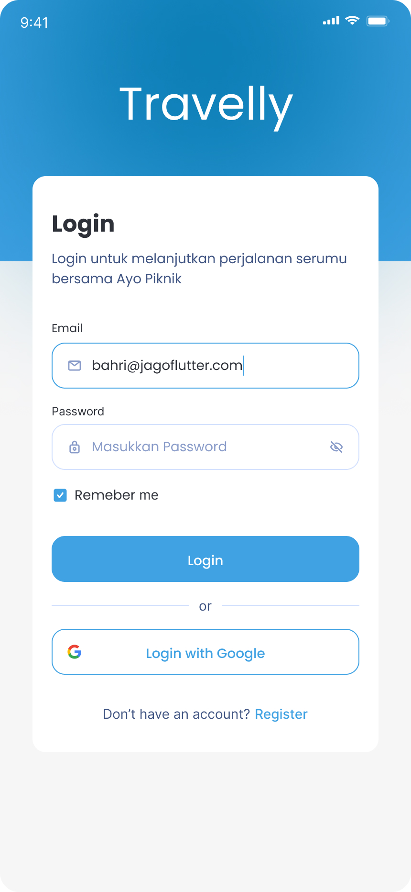
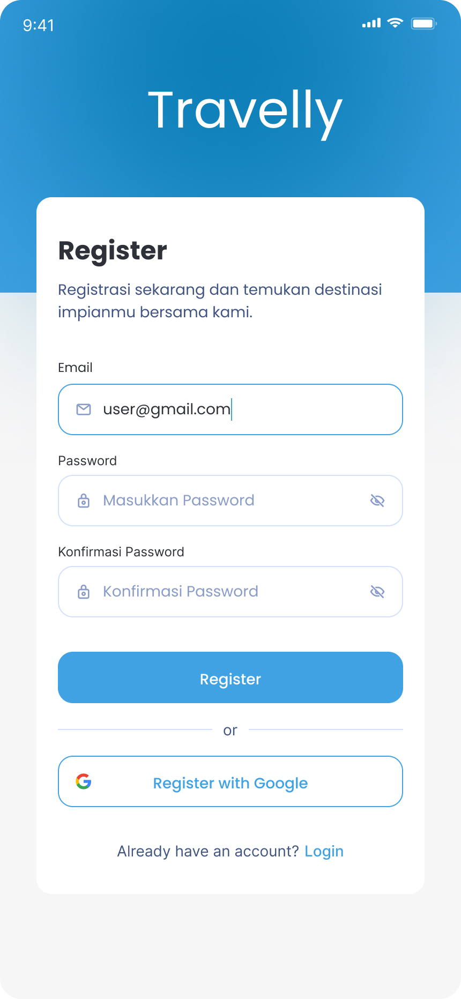
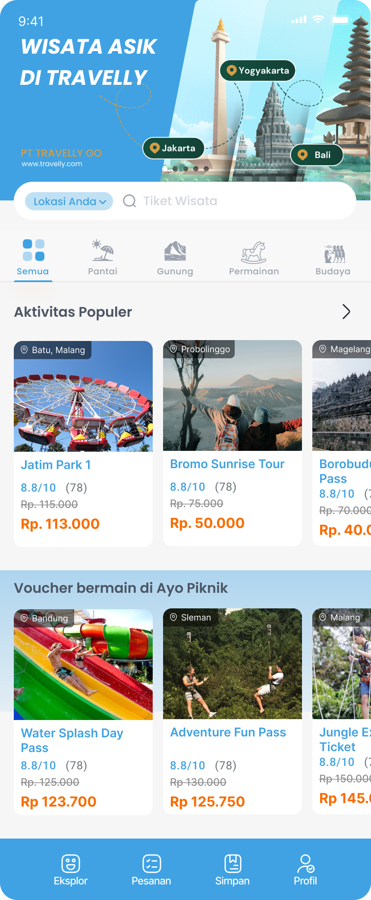
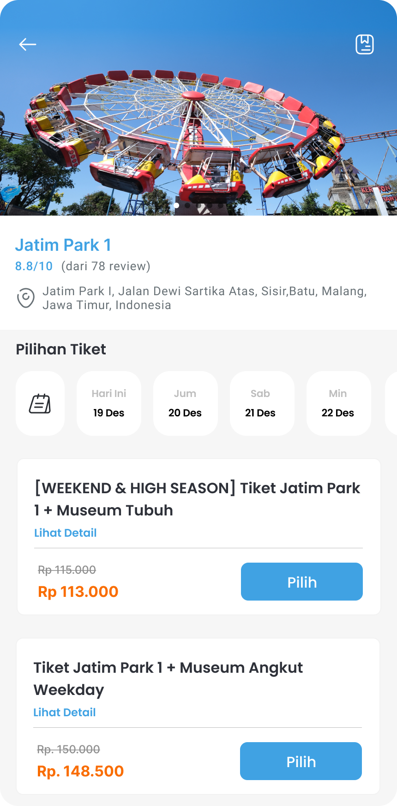

# Travelly

Aplikasi mobile untuk pemesanan tiket wisata dan manajemen destinasi wisata. Dibangun menggunakan Flutter dengan fitur untuk pengunjung dan mitra wisata.

## Fitur Utama

### Untuk Pengunjung

- Pencarian dan pemesanan tiket destinasi wisata
- Manajemen pesanan dan riwayat transaksi
- Pembayaran digital terintegrasi
- Penyimpanan tiket favorit
- QR Code untuk validasi tiket

### Untuk Mitra Wisata

- Manajemen destinasi dan event wisata
- Pengelolaan tiket dan harga
- Validasi tiket pengunjung via QR Code scanner
- Laporan transaksi
- Status verifikasi akun mitra

## Teknologi

- Flutter
- Bloc Pattern untuk state management
- Integrasi pembayaran digital
- QR Code scanning
- Multi-bahasa (ID/EN)

## Tampilan Aplikasi

|          Screenshot 1          |          Screenshot 2          |
| :----------------------------: | :----------------------------: |
|  |  |
|          Screenshot 3          |          Screenshot 4          |
|  |  |
